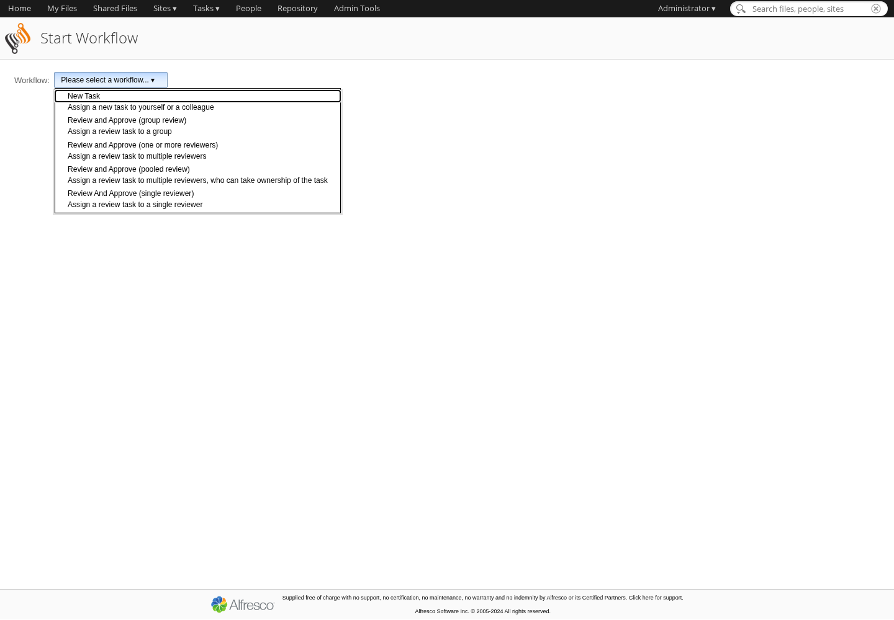
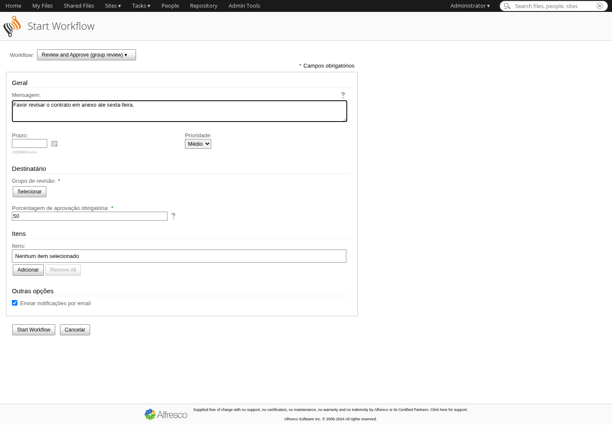
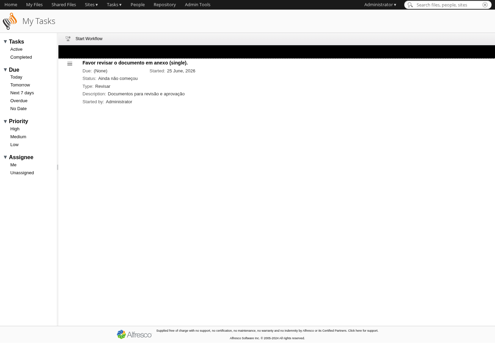
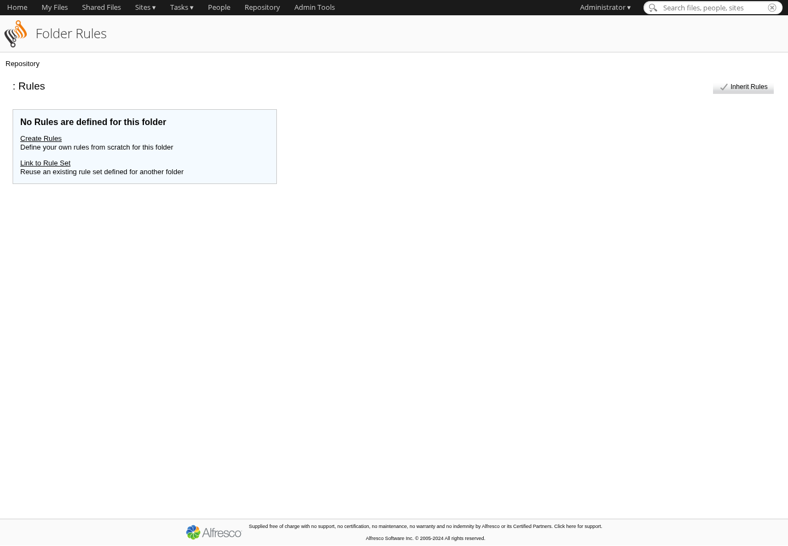

# Manual de Fluxos de Trabalho (Workflows) — Alfresco Community
### Plataforma de Gestão Eletrônica de Documentos (GED)

> Segundo manual da plataforma. Cobre os **fluxos de trabalho (workflows)** do
> Alfresco: como **iniciar**, **acompanhar** e **concluir** tarefas; como automatizar
> com **Regras de pasta** (workflows baseados em pasta); e, para a equipe técnica,
> como **criar e customizar** novos fluxos com **Activiti (BPMN 2.0)**.
>
> **Como usar este manual:** onde houver `[📷 CAPTURA → images/NN-*.png: ...]`,
> insira o print real correspondente antes de distribuir/treinar. Esses prints são
> gerados automaticamente pelo robô
> [screenshots-alfresco/capturar-prints-workflows.js](screenshots-alfresco/capturar-prints-workflows.js)
> (rode no servidor com `sudo ./gerar-prints-workflows.sh` e copie os PNGs para
> `images/`). Os quadros em ASCII mostram a posição dos botões para você se localizar.
>
> Pré-requisito: estar à vontade com o **Manual do Usuário** (acesso, biblioteca de
> documentos, upload e versões).

---

## Sumário

1. [O que é um fluxo de trabalho](#1-o-que-é-um-fluxo-de-trabalho)
2. [Os fluxos prontos do Alfresco](#2-os-fluxos-prontos-do-alfresco)
3. [Iniciar um fluxo a partir de um documento](#3-iniciar-um-fluxo-a-partir-de-um-documento)
4. [Minhas tarefas: receber, analisar e concluir](#4-minhas-tarefas-receber-analisar-e-concluir)
5. [Acompanhar um fluxo que você iniciou](#5-acompanhar-um-fluxo-que-você-iniciou)
6. [Tarefas em grupo (pooled)](#6-tarefas-em-grupo-pooled)
7. [Workflows baseados em pasta (Regras)](#7-workflows-baseados-em-pasta-regras)
8. [Boas práticas de fluxos](#8-boas-práticas-de-fluxos)
9. [⚙️ Customização: criar fluxos novos (Activiti/BPMN)](#9-️-customização-criar-fluxos-novos-activitibpmn)
10. [Perguntas frequentes (FAQ)](#10-perguntas-frequentes-faq)

---

## 1. O que é um fluxo de trabalho

Um **fluxo de trabalho** (em inglês, *workflow*) é um **caminho de tarefas** que um
documento percorre entre pessoas — por exemplo: *enviar para revisão* → *aprovar* →
*arquivar*. Em vez de mandar o arquivo por e-mail e perder o controle, o Alfresco:

- 📨 **entrega a tarefa** para a pessoa certa (e avisa no painel dela);
- ⏱️ controla **prazo** e **prioridade**;
- 🧭 registra **quem fez o quê e quando** (trilha de auditoria);
- 🔁 segue **automaticamente** para a próxima etapa quando a atual é concluída.

**Os dois mundos do Alfresco — não confundir:**

| | Fluxo de trabalho (workflow) | Tarefa simples |
|---|---|---|
| O que é | Processo com várias etapas e regras | Uma única atribuição avulsa |
| Motor | **Activiti (BPMN 2.0)** | — |
| Exemplos | Revisar e Aprovar, Revisão em Grupo | "Lembrar fulano de tal" |

> 💡 No Alfresco Community 23, o motor de workflow é o **Activiti**, que executa
> diagramas no padrão **BPMN 2.0**. Você **não** precisa entender BPMN para *usar*
> os fluxos — só para *criar* novos (seção 9).

**Visão simples do ciclo de vida:**

```
   Iniciador                    Destinatário(s)                 Resultado
   ┌──────────┐   inicia   ┌────────────────────┐   conclui   ┌──────────┐
   │ documento│ ─────────▶ │  Tarefa pendente   │ ──────────▶ │ Aprovado │
   │  + fluxo │            │  (Minhas tarefas)  │             │   ou     │
   └──────────┘            │  Aprovar / Rejeitar│             │ Rejeitado│
                           └────────────────────┘             └──────────┘
```

---

## 2. Os fluxos prontos do Alfresco

O Alfresco já vem com **fluxos padrão** (out-of-the-box). São suficientes para a
maioria dos casos de revisão e aprovação:

| Fluxo | Para quê | Quem conclui |
|---|---|---|
| **Nova Tarefa** (*New Task*) | Atribuir uma tarefa avulsa a alguém. | 1 pessoa |
| **Revisar e Aprovar** (*Review And Approve*) | 1 revisor aprova ou rejeita o documento. | 1 pessoa |
| **Revisão em Grupo** (*Group Review*) | Um **grupo** revisa; basta a % configurada aprovar. | Grupo (pooled) |
| **Revisão Paralela** (*Parallel Review*) | **Vários revisores ao mesmo tempo**; consolida o resultado. | Várias pessoas |
| **Adhoc / Tarefa Atribuída** | Encaminhar uma atividade livre, sem aprovação formal. | 1 pessoa |

```
   Iniciar fluxo de trabalho  ▾
   ├─ Nova tarefa
   ├─ Revisar e aprovar (Review And Approve)        ◀── o mais usado
   ├─ Revisão em grupo (Group Review)
   ├─ Revisão paralela (Parallel Review)
   └─ Adhoc (tarefa atribuída)
```

> 💡 **Qual escolher?**
> • Uma pessoa decide → **Revisar e Aprovar**.
> • Vários precisam opinar e cada um responde → **Revisão Paralela**.
> • Qualquer um de uma equipe pode pegar → **Revisão em Grupo** (seção 6).

{ width=98% }

---

## 3. Iniciar um fluxo a partir de um documento

1. Abra o documento (página de detalhes) **ou** marque-o na lista.
2. No menu de ações, clique em **Iniciar fluxo de trabalho** (*Start Workflow*).
3. Escolha o **tipo** de fluxo (ex.: *Revisar e Aprovar*).
4. Preencha o formulário:
   - **Mensagem / descrição** — instrução para quem vai receber;
   - **Destinatário(s)** — clique em **Selecionar** e escolha a(s) pessoa(s) ou grupo;
   - **Prazo** (*Due date*) — data limite;
   - **Prioridade** — Baixa / Média / Alta;
   - **Itens** — o(s) documento(s) anexado(s) ao fluxo (já vem o que você selecionou).
5. Clique em **Iniciar fluxo de trabalho**.

```
┌─ Iniciar fluxo: Revisar e Aprovar ─────────────────────────────────────────┐
│ Mensagem:    [ Favor revisar o contrato em anexo até sexta.            ]    │
│ Destinatário:[ Maria Silva ]                          [ Selecionar... ]     │
│ Prazo:       [ 27/06/2026 ]   Prioridade: ( ) Baixa (•) Média ( ) Alta      │
│ Itens:       📄 Contrato-X.pdf                              [ Adicionar ]    │
│                                                                             │
│                         [ Cancelar ]   [ Iniciar fluxo de trabalho ]        │
└─────────────────────────────────────────────────────────────────────────────┘
```

Pronto: a tarefa aparece **no painel do destinatário** (em *Minhas tarefas*) e o
documento fica marcado como "em fluxo de trabalho".

> 💡 Você pode anexar **mais de um documento** ao mesmo fluxo (botão **Adicionar**
> em *Itens*).

{ width=98% }

---

## 4. Minhas tarefas: receber, analisar e concluir

Quando alguém envia um fluxo para você, a tarefa chega em **Tarefas ▾ → Minhas
tarefas** (e também aparece no **painel inicial**).

```
┌─ Minhas tarefas ───────────────────────────────────────────────────────────┐
│ ⏳ Revisar "Contrato-X.pdf"        de João   prazo 27/06   prioridade: Média │
│ ⏳ Aprovar "Política.pdf"          de Ana    prazo 28/06   prioridade: Alta  │
└─────────────────────────────────────────────────────────────────────────────┘
```

**Para concluir uma tarefa:**

1. **Tarefas ▾ → Minhas tarefas** → clique na tarefa (ou em **Editar tarefa**).
2. Leia a mensagem e **abra o documento anexado** para analisar (pré-visualização
   ou **Baixar**).
3. (Opcional) escreva um **comentário** justificando sua decisão.
4. Clique no botão de desfecho — que varia conforme o fluxo:
   - **Aprovar** / **Rejeitar** (Revisar e Aprovar);
   - **Tarefa concluída** (*Task Done*) (Adhoc / Nova tarefa);
   - **Reivindicar** (*Claim*) antes de responder, no caso de grupo (seção 6).

```
┌─ Tarefa: Revisar "Contrato-X.pdf" ─────────────────────────────────────────┐
│ De: João   •   Prazo: 27/06   •   Prioridade: Média                         │
│ Mensagem: "Favor revisar o contrato em anexo até sexta."                    │
│ Itens:    📄 Contrato-X.pdf   [ Visualizar ] [ Baixar ]                     │
│ Comentário: [ De acordo, sem ressalvas.                              ]      │
│                                                                             │
│              [ Rejeitar ]            [ Aprovar ]            [ Salvar ]       │
└─────────────────────────────────────────────────────────────────────────────┘
```

> 💡 **Salvar** guarda o que você escreveu **sem concluir** a tarefa (ela continua
> sua). Só **Aprovar/Rejeitar/Concluir** encerra a sua etapa e empurra o fluxo
> adiante.

{ width=98% }

{ width=98% }

---

## 5. Acompanhar um fluxo que você iniciou

Quem **abre** o fluxo acompanha o andamento em **Tarefas ▾ → Fluxos de trabalho que
iniciei** (*Workflows I've Started*).

Ali você vê, para cada fluxo:

- o **status** (em andamento / concluído);
- em qual **etapa** está e com **quem**;
- o **histórico** de cada tarefa já concluída (quem, quando, decisão).

```
┌─ Fluxos de trabalho que iniciei ───────────────────────────────────────────┐
│ ▸ Revisar "Contrato-X.pdf"     em andamento   etapa: Revisão (Maria)        │
│ ▸ Aprovar "Aditivo.pdf"        concluído      resultado: Aprovado           │
└─────────────────────────────────────────────────────────────────────────────┘
```

**Ações do iniciador:**
- **Cancelar fluxo de trabalho** — encerra o processo (a tarefa some do painel do
  destinatário).
- **Excluir** — remove o registro de um fluxo já concluído.

> 💡 Não recebeu resposta a tempo? Abra o fluxo, veja em quem ele está parado e,
> se preciso, **cancele e reinicie** com outro destinatário/prazo.

{ width=98% }

---

## 6. Tarefas em grupo (pooled)

Nos fluxos de **grupo** (ex.: *Revisão em Grupo*), a tarefa não vai para **uma**
pessoa — ela cai numa **fila compartilhada** (*pool*) que **todos os membros do
grupo** enxergam. O fluxo é:

1. A tarefa aparece em **Tarefas ▾ → Minhas tarefas** de **todos** do grupo, com o
   botão **Reivindicar** (*Claim*).
2. Quem vai cuidar dela clica em **Reivindicar** — a tarefa passa a ser **só dele**
   e some da fila dos outros.
3. Ele conclui normalmente (**Aprovar/Rejeitar**).
4. Se desistir, clica em **Liberar para o grupo** (*Release to pool*) e a tarefa
   volta para a fila.

```
   Grupo "Jurídico"  (fila compartilhada)
   ┌──────────────────────────────────────────┐
   │ ⏳ Revisar "Minuta.pdf"   [ Reivindicar ] │ ◀── qualquer membro pega
   └──────────────────────────────────────────┘
            │  Maria clica em "Reivindicar"
            ▼
   Vira tarefa pessoal da Maria  →  [ Aprovar ] [ Rejeitar ] [ Liberar p/ grupo ]
```

> 💡 Em **Revisão em Grupo** dá para exigir um **percentual mínimo de aprovações**
> (ex.: 50%) para o documento ser considerado aprovado.

{ width=98% }

---

## 7. Workflows baseados em pasta (Regras)

Esta é a forma de **automatizar** fluxos: em vez de a pessoa iniciar o fluxo na mão,
a **própria pasta** dispara a ação quando um documento entra. No Alfresco isso se
chama **Regras** (*Rules*) — é o mesmo mecanismo que faz a **assinatura digital
por pasta** ("A Assinar" → "Assinados") funcionar.

> 🧠 **Conceito:** uma **Regra de pasta** é um gatilho do tipo
> **"QUANDO** acontecer X na pasta, **SE** o item bater com tal condição,
> **ENTÃO** execute tal ação**"**. Uma das ações possíveis é **Iniciar um fluxo de
> trabalho**.

### Onde ficam as regras
Entre na pasta → menu de ações da pasta (engrenagem ⚙ ou **Mais...**) →
**Gerenciar regras** (*Manage Rules*).

```
   📁 Contratos a Revisar
        ⚙ Mais...
        ├─ Gerenciar regras        ◀── clique aqui
        ├─ Gerenciar permissões
        └─ ...
```

### Criar uma regra que inicia um fluxo (passo a passo)
1. Entre na pasta desejada → **Gerenciar regras** → **Criar regras** (*Create Rules*).
2. **Nome** da regra (ex.: `Enviar para revisão jurídica`).
3. **Quando** (gatilho):
   - **Itens são criados ou entram nesta pasta** (o mais comum);
   - *Itens são atualizados*;
   - *Itens são excluídos/saem da pasta*.
4. **Se** (condição — opcional): ex.: *Tipo de conteúdo é PDF*, *Nome contém
   "contrato"*, ou **Todos os itens**.
5. **Executar ação** (*Perform Action*): escolha **Iniciar fluxo de trabalho** e
   configure o tipo, o destinatário e o prazo (igual à seção 3).
6. Opções úteis:
   - ☑ **Aplicar regra a subpastas** (herança);
   - ☑ **Executar regra em background** (assíncrono);
   - **Regra em caso de erro** (ação alternativa se falhar).
7. **Criar** / **Salvar**.

```
┌─ Nova regra: "Enviar para revisão jurídica" ───────────────────────────────┐
│ Quando:   [ Itens entram nesta pasta            ▾ ]                         │
│ Se:       [ Tipo é PDF                          ▾ ]   ( ) inverter          │
│ Então:    [ Iniciar fluxo de trabalho           ▾ ]                         │
│           └─ Tipo: Revisar e Aprovar · Destinatário: grupo "Jurídico"       │
│ ☑ Aplicar a subpastas    ☑ Executar em background                          │
│                                        [ Cancelar ]   [ Criar ]            │
└─────────────────────────────────────────────────────────────────────────────┘
```

**Resultado:** a partir daí, **todo PDF** colocado nessa pasta dispara
automaticamente um fluxo "Revisar e Aprovar" para o grupo Jurídico — sem ninguém
precisar iniciar nada.

### Outras ações úteis numa regra (além de iniciar fluxo)
- **Mover / Copiar** o item para outra pasta;
- **Adicionar aspecto / tag** (classificar automaticamente);
- **Enviar e-mail** de notificação;
- **Executar script** (Action / JavaScript do servidor) — é o que, por exemplo, encadeia
  a assinatura digital por pasta.

> ✍️ **A assinatura por pasta é uma Regra:** a pasta **"A Assinar"** tem uma regra
> *"quando um PDF entrar → executar a ação de assinatura → mover para Assinados"*.
> Entender Regras é entender como aquela automação funciona.

> ⚠️ **Cuidado com loops:** uma regra que **move/copia** itens para uma pasta que
> também tem regra pode disparar em cascata. Teste com poucos arquivos antes de
> liberar para todos.

{ width=98% }

{ width=98% }

---

## 8. Boas práticas de fluxos

- 🎯 **Escolha o fluxo certo:** uma pessoa decide → *Revisar e Aprovar*; vários
  opinam → *Revisão Paralela*; equipe compartilha → *Revisão em Grupo*.
- 📝 **Escreva instruções claras** na mensagem do fluxo — o destinatário precisa
  saber o que fazer e até quando.
- 📅 **Sempre defina prazo e prioridade** — sem isso, tarefas "encalham".
- 🗂️ **Automatize com Regras** o que é repetitivo (toda NF entra → fluxo de
  conferência), mas comece com **poucas regras simples**.
- 🧪 **Teste a regra** com 1–2 arquivos antes de aplicar à pasta inteira/subpastas.
- 👥 Prefira **grupos** a pessoas nomeadas nos fluxos recorrentes — quando alguém
  sai da empresa, o fluxo continua funcionando.
- 🔎 **Acompanhe** em *Fluxos que iniciei* e cobre os pendentes.
- 🧹 **Cancele/exclua** fluxos antigos e concluídos para manter o painel limpo.

---

## 9. ⚙️ Customização: criar fluxos novos (Activiti/BPMN)

> 👷 **Seção técnica** — destinada à equipe de TI / administração do Alfresco, não
> ao usuário final. Requer acesso ao servidor e reinício de serviços.

Quando os fluxos prontos não bastam (ex.: um processo de aprovação de contratos com
3 etapas, valores e setores diferentes), cria-se um **fluxo customizado**. Um
workflow Activiti completo é feito de **três peças**:

```
   ┌──────────────────────┐   ┌──────────────────────┐   ┌──────────────────────┐
   │  1. Definição BPMN   │   │  2. Modelo de tarefa │   │  3. Configuração de  │
   │  (o diagrama .bpmn)  │ + │  (content/task model)│ + │  formulários (Share) │
   │  etapas, decisões,   │   │  campos das tarefas  │   │  como o form aparece │
   │  atribuições         │   │  (XML)               │   │  (share-config)      │
   └──────────────────────┘   └──────────────────────┘   └──────────────────────┘
```

### Peça 1 — Definição do processo (BPMN 2.0)
Um arquivo `.bpmn20.xml` descreve o **diagrama**: início, **tarefas de usuário**
(*userTask*), **gateways** (decisões: aprovado? sim/não), atribuições (assignee) e
fim. Modela-se visualmente no **Activiti Modeler / Camunda Modeler** ou à mão.

```xml
<userTask id="revisar" name="Revisar contrato"
          activiti:assignee="${bpm_assignee.properties.userName}">
  <extensionElements>
    <activiti:formKey>gedwf:revisarContrato</activiti:formKey>
  </extensionElements>
</userTask>
<exclusiveGateway id="decisao"/>
<sequenceFlow sourceRef="decisao" targetRef="aprovado">
  <conditionExpression>${gedwf_aprovado == true}</conditionExpression>
</sequenceFlow>
```

### Peça 2 — Modelo de conteúdo / tarefa (content model)
Um XML de modelo (`*-model.xml`) define o **type/aspect** das tarefas e as
**propriedades** (campos) que cada tarefa terá (ex.: `gedwf:valorContrato`,
`gedwf:aprovado`). É o que dá "memória" e campos ao fluxo.

```xml
<type name="gedwf:revisarContrato">
  <parent>bpm:workflowTask</parent>
  <properties>
    <property name="gedwf:aprovado"><type>d:boolean</type></property>
  </properties>
</type>
```

### Peça 3 — Configuração dos formulários (Share)
Um `share-config-custom.xml` diz **como o formulário da tarefa aparece** para o
usuário no Share (quais campos, rótulos, obrigatórios, leitura/escrita).

### Onde instalar (no servidor)
Empacota-se tudo como **módulo/extensão** e implanta-se em:

- **Repositório (platform):** o `*-context.xml` que registra o `processDeployment`
  do `.bpmn20.xml` e o `bootstrap` do model →
  `tomcat/shared/classes/alfresco/extension/` (ou um **AMP/JAR** em
  `/opt/alfresco/modules/platform`).
- **Share:** o `share-config-custom.xml` →
  `tomcat/shared/classes/alfresco/web-extension/`.

Depois, **reiniciar** os serviços do Alfresco (Tomcat) para registrar o processo.
A partir daí o novo fluxo aparece na lista de **Iniciar fluxo de trabalho** e pode
ser usado inclusive como ação de **Regra de pasta** (seção 7).

> 🛠️ **Caminho recomendado:** comece **adaptando** um fluxo pronto (ex.: clonar o
> *Review And Approve*) em vez de criar do zero — menos risco e curva mais suave.

> 📌 **Nota:** a modelagem de fluxos próprios (BPMN) costuma ser uma etapa de
> projeto à parte. Esta seção é a referência técnica para implementá-los.

`[📷 CAPTURA (manual/opcional): novo fluxo customizado aparecendo na lista "Iniciar fluxo de trabalho" — só existe após implantar um fluxo BPMN próprio]`

---

## 10. Perguntas frequentes (FAQ)

**Qual a diferença entre "tarefa" e "fluxo de trabalho"?**
O **fluxo** é o processo inteiro (com etapas); a **tarefa** é uma etapa dele que cai
no seu painel. Um fluxo pode gerar várias tarefas.

**Iniciei um fluxo para a pessoa errada. E agora?**
Vá em **Tarefas ▾ → Fluxos de trabalho que iniciei**, abra o fluxo e
**Cancele**; depois inicie de novo com o destinatário certo.

**A tarefa não apareceu para o destinatário.**
Confirme que o fluxo foi **iniciado** (não só salvo) e que o destinatário está
correto. Em fluxos de **grupo**, a tarefa só "vira dele" depois de **Reivindicar**
(seção 6).

**Aprovei sem querer.**
A etapa já foi concluída e não dá para "desfazer" a tarefa. Quem iniciou pode
**cancelar** o fluxo e recomeçar.

**Posso anexar mais de um documento a um fluxo?**
Sim — no formulário de início, use **Adicionar** em *Itens*.

**Como faço para todo arquivo de uma pasta entrar em revisão automaticamente?**
Crie uma **Regra de pasta** com ação **Iniciar fluxo de trabalho** (seção 7).

**Minha regra disparou em loop / em arquivos demais.**
Provavelmente a ação **move/copia** para uma pasta que também tem regra, ou a regra
está aplicada a subpastas. Revise as condições e desmarque *Aplicar a subpastas* se
não for necessário.

**Preciso de um fluxo que o Alfresco não tem.**
É possível criar um fluxo customizado em **Activiti/BPMN** (seção 9) — tarefa da
equipe técnica.

---

### Suporte
Suporte técnico pós go-live via abertura de chamados (GLPI).
Dúvidas do treinamento: **OpenTechs**.

*Documento de treinamento — uso interno.*
